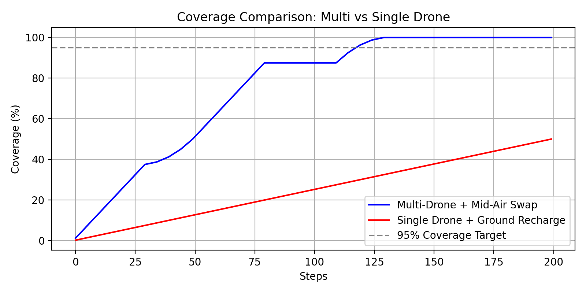
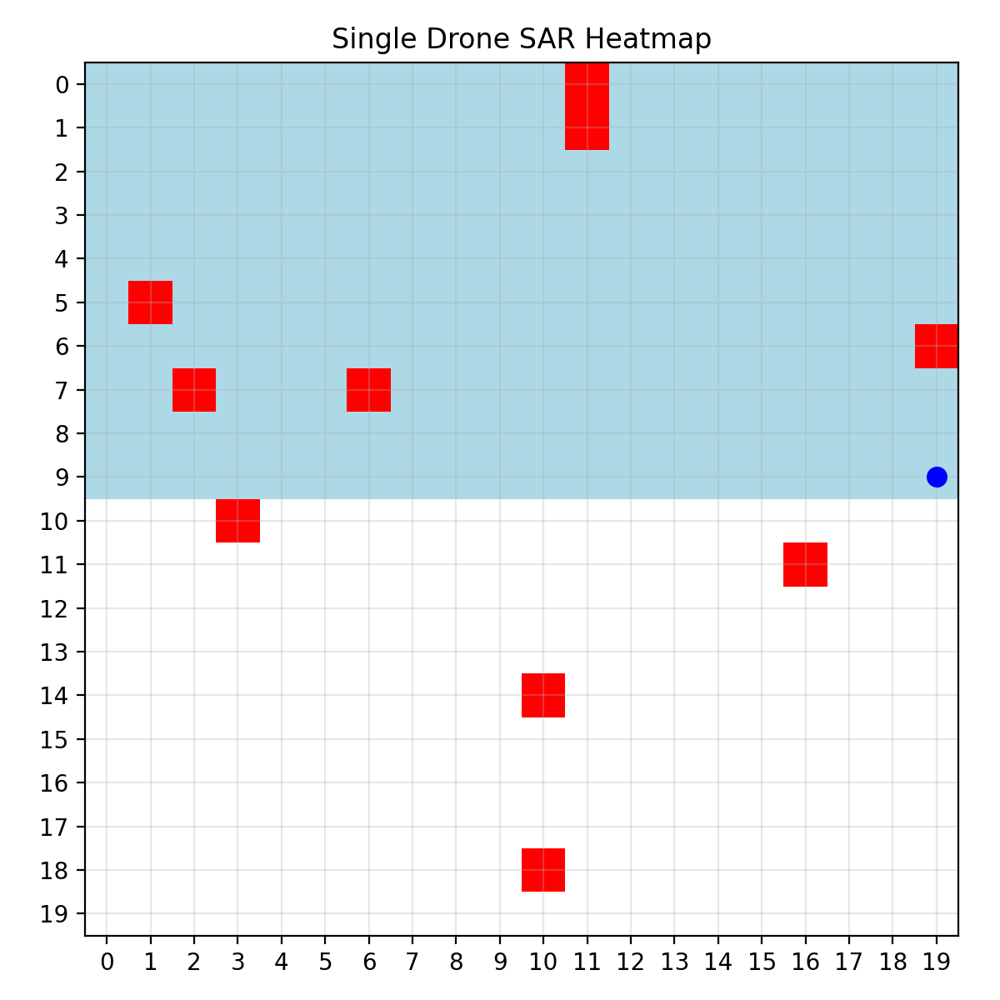
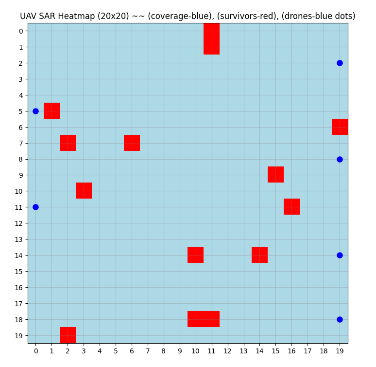

# uav-sar-swarm-simulation
Python simulation for UAV Search &amp; Rescue comparing single-drone battery recharge vs. swarm mid-air battery swapping models
# DResque: Multi-Drone Search & Rescue Simulation 🚁

## 📌 Project Overview
**DResque** is a comparative simulation study addressing the limitations of traditional Search and Rescue (SAR) operations. This project models a **20x20 disaster grid** to evaluate the efficiency of a **Multi-Drone Swarm** against a Single-Drone system.

The core innovation is the implementation of a **"Mid-Air Battery Swap"** algorithm, where helper drones replenish search drones mid-flight, eliminating the need to return to ground stations for recharging.

## 🚀 Key Features
* **Algorithmic Path Planning:** Implements **Serpentine Search Patterns** for systematic area coverage (Single: Sequential | Multi: Band-based).
* **Novel Energy Management:**
    * *Single Drone:* Returns to base for "Ground Recharge" upon battery depletion.
    * *Swarm System:* Uses **Helper Drones** for autonomous **Mid-Air Battery Swaps**, significantly reducing downtime.
* **Decision Logic:** Simulates real-time decision-making: `System Health Check` → `Battery Status` → `Low Battery Response` (Return vs. Swap).
* **Visualization:** Generates real-time **Heatmaps** and coverage charts using `matplotlib` to visualize survivor detection and "visited" nodes.

## 📊 Research Results
The simulation compared both approaches over 200 steps.The Swarm system demonstrated superior efficiency in coverage and survivor detection.

| Metric | Single Drone (Ground Charge) | Swarm (Mid-Air Swap) | Improvement |
| :--- | :--- | :--- | :--- |
| **Area Coverage** | 50% (at 200 steps) | **95% (at ~125 steps)** | ⚡ **2x Faster Coverage** |
| **Survivor Detection** | ~60% (6/10 survivors) | **100% (All survivors)** | 🎯 **Full Detection** |
| **Energy Events** | 5-6 Ground Recharges | **3-4 Mid-Air Swaps** | 🔋 **Fewer Interruptions** |

*> **Note:** The Single Drone approach plateaus significantly due to travel time back to base, whereas the Swarm maintains near-continuous operation.*

## 🛠️ Tech Stack
* **Language:** Python 3.x
* **Core Logic:** `NumPy` (Grid/Matrix Management)
* **Visualization:** `Matplotlib` (Heatmaps/Charts), `FFmpeg` (Animation generation)
* **Simulation Logic:** Custom state-machine for drone battery and health monitoring.

## 📂 Visuals & Simulation Demos
### 1. Coverage Efficiency
The Swarm system (Blue) reaches 95% coverage rapidly, while the Single Drone (Red) struggles due to frequent recharging downtime.

### 2. Heatmap Comparison
A comparison of the final "Visited Nodes" (Blue) and "Detected Survivors" (Red). Note the gaps in the Single Drone's coverage.
| Single Drone (Ground Recharge) | Multi-Drone Swarm (Mid-Air Swap) |
| :---: | :---: |
|  |  |
| *Struggles to cover the upper half* | *Complete grid coverage achieved* |
### 3. Simulation Demos 🎥
Watch the autonomous decision logic in action.

| **Scenario A: Single Drone** | **Scenario B: Swarm System** |
| :---: | :---: |
| (https://github.com/user-attachments/assets/9f5dfc1e-45b7-4ce5-aeca-687dd6ee920a) | (https://github.com/user-attachments/assets/b9818912-b3c0-48fa-b26b-37a412df58e7) |
| *Struggles for complete coverage due to battery | *Continuous operation via mid-air swaps* |

## 📜 Methodology
1.  **Environment Setup:** A 20x20 grid with randomly placed survivor nodes.
2.  **Execution:** Drones scan the grid. Upon `Low Battery` signal, the swarm algorithm calculates the nearest `Helper Drone` for a swap, while the single drone calculates a path back to `Base (0,0)`.
3.  **Metrics:** The script logs step count, coverage %, and energy events to a CSV for analysis.

## 🤝 Contributors
* **Shaurya Jain** - *Lead Developer & Simulation Logic*
* **Vanshita Surana** - *Research & Documentation*
